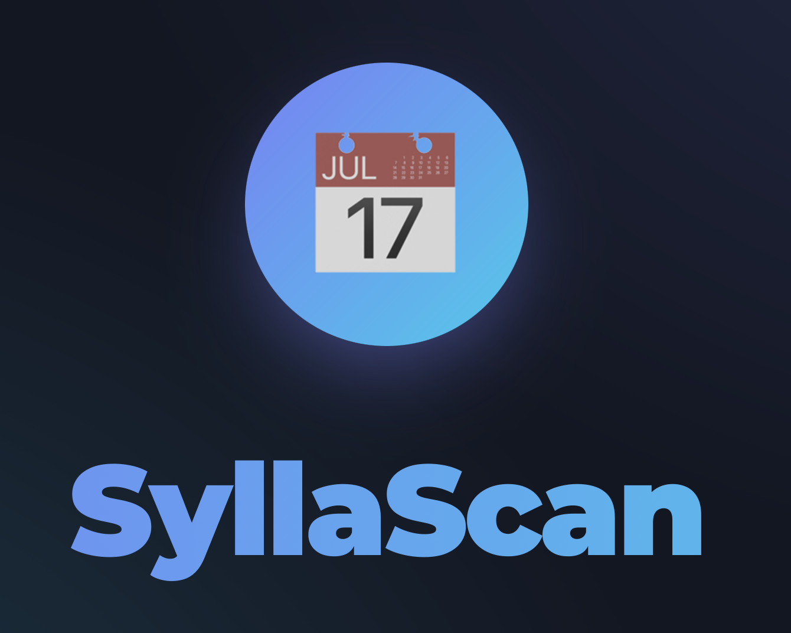

# SyllaScan

<div align="center">
  
  
  <p><em>by Martin Ofunrein</em></p>
  
  ### 🌐 [Try it live at syllascan-martin.vercel.app](https://syllascan-martin.vercel.app/)
</div>

## What is this?

I built SyllaScan because I was tired of manually copying dates from syllabi into my calendar every semester. It uses AI (OpenAI's Vision API) to read your syllabus and automatically detect assignments, exams, and important dates, then lets you add them to Google Calendar.

Upload a PDF or image of your syllabus, and it'll extract all the events for you. That's pretty much it.

## Features

- Upload syllabi as PDF, JPG, or PNG
- AI automatically finds dates, assignments, and exams
- Edit events before adding them to your calendar
- Connect with Google Calendar to add events directly
- Works on mobile
- Dark mode because it's 2025
- History of everything you've processed

## Tech Stack

**Frontend:**
- Next.js 15 (React 19)
- TypeScript
- Tailwind CSS
- React Big Calendar for the calendar view

**Backend:**
- Firebase (Auth + Firestore)
- OpenAI Vision API for the actual document reading
- Google Calendar API
- Hosted on Vercel

**Other stuff:**
- PDF.js for rendering PDFs
- NextAuth for handling OAuth

## Getting Started

### If you just want to use it:
1. Go to [syllascan-martin.vercel.app](https://syllascan-martin.vercel.app/)
2. Sign in with Google
3. Upload your syllabus
4. Review and edit the detected events
5. Add them to your calendar

### If you want to run it locally:

```bash
git clone https://github.com/yourusername/syllascan.git
cd syllascan
npm install
```

Copy `.env.example` to `.env` and add your API keys:
- Firebase config
- OpenAI API key
- Google OAuth credentials

Then run:
```bash
npm run dev
```

Visit `http://localhost:3000`

## How it works

1. You upload a document
2. The backend sends it to OpenAI's Vision API with a prompt asking it to find academic events
3. OpenAI returns structured data with dates, titles, and descriptions
4. You can edit these events on the frontend
5. When you're happy with them, click to add them to Google Calendar via their API
6. Everything gets saved to Firestore so you can see your processing history

## Limitations

- OpenAI isn't perfect, so double-check the dates it finds
- Works best with clearly formatted syllabi (the messier the document, the more manual editing you'll need)
- Only supports Google Calendar right now

## What's next

Things I might add:
- Support for other calendar apps (Outlook, iCal)
- Better handling of recurring events
- Integration with Canvas/Blackboard
- Improved AI accuracy with better prompts or fine-tuning

## Contributing

If you find bugs or want to add features, feel free to open an issue or PR.

## License

MIT License - do whatever you want with this.

## Credits

Thanks to OpenAI for the Vision API, Google for the Calendar API, and the Next.js team for making React development not terrible.
