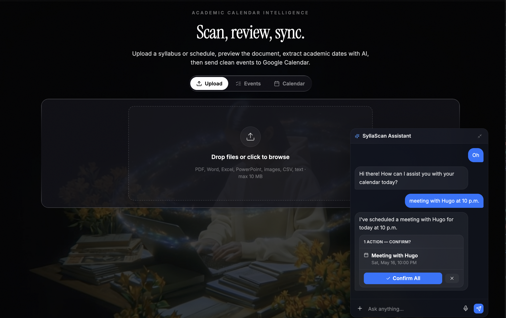
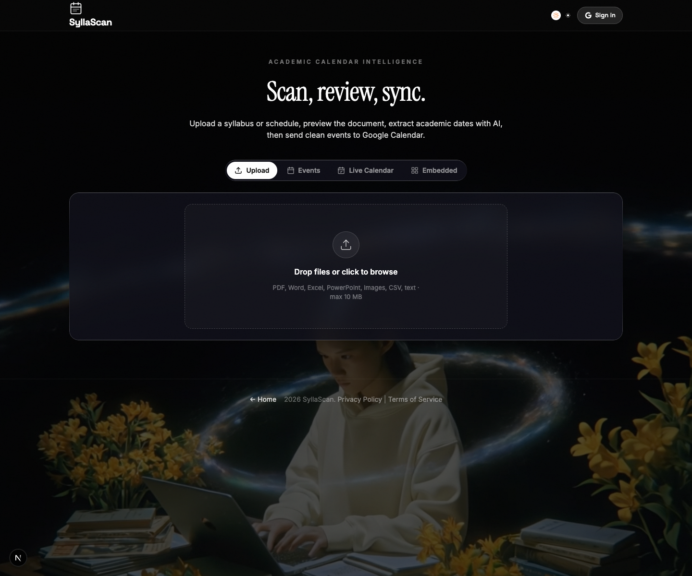

# SyllaScan

<div align="center">
  <p><em>by Martin Ofunrein</em></p>
  
  ### 🌐 [Try it live at syllascan-martin.vercel.app](https://syllascan-martin.vercel.app/)

  ## **📺 [Watch Demo Video](https://www.youtube.com/watch?v=rgZdCt-NPOg)**
  
  <br/>
  
  [](https://www.youtube.com/watch?v=rgZdCt-NPOg)
  
</div>


## What is this?

I built SyllaScan because manually copying dates from syllabi into my calendar every semester was inefficient. It uses AI (OpenAI's Vision API) to scan your dates, events, syllabus, and automatically detect assignments, exams, and important dates with details, then lets you add them to Google Calendar.

Upload multiple images or PDFs of all your events, dates, and syllabi, and it'll extract all the events for you. That's it.

After the scan, if a revision is needed, you can edit events manually or use the AI assistant by sending a simple chat for efficiency.


## Features

- Upload events or syllabi as PDF, JPG, or PNG
- AI automatically finds dates, assignments, and exams
- Edit events before adding them to your calendar
- Connect with Google Calendar to add events directly
- Works on mobile
- Dark mode because it's 2025
- History of everything you've processed

## Tech Stack

**Frontend:**
- Next.js 15 (React 19)
- TypeScript
- Tailwind CSS
- React Big Calendar for the calendar view

**Backend:**
- Supabase (Auth + database)
- OpenAI Vision API for the actual document reading
- Google Calendar API
- Hosted on Vercel

**Other stuff:**
- PDF.js for rendering PDFs

## Getting Started

### If you just want to use it:
1. Go to [syllascan-martin.vercel.app](https://syllascan-martin.vercel.app/)
2. Sign in with Google
3. Upload your pictures, syllabus, or events (png, jpg, pdf)
4. Review and edit the detected events
5. Add them to your calendar

### If you want to run it locally:

```bash
git clone https://github.com/yourusername/syllascan.git
cd syllascan
npm install
```

Copy `.env.example` to `.env` and add your API keys:
- Supabase config
- OpenAI API key
- Google OAuth credentials

Then run:
```bash
npm run dev
```

Visit `http://localhost:3000`

## How it works

1. You upload a document
2. The backend sends it to OpenAI's Vision API with a prompt asking it to find academic events
3. OpenAI returns structured data with dates, titles, and descriptions
4. You can edit these events on the frontend
5. When you're happy with them, click to add them to Google Calendar via their API
6. Everything gets saved to Supabase so you can see your processing history

## Limitations

- OpenAI isn't perfect, so double-check the dates it finds
- Works best with clearly formatted syllabi (the messier the document, the more manual editing you'll need)
- Only supports Google Calendar right now

## What's next

Things I might add:
- Support for other calendar apps (Outlook, iCal)
- Better handling of recurring events
- Integration with Canvas/Blackboard
- Improved AI accuracy with better prompts or fine-tuning

## Contributing

If you find bugs or want to add features, feel free to open an issue or PR.

## License

MIT License - do whatever you want with this.

## Credits

Thanks to OpenAI for the Vision API, Google for the Calendar API, and the Next.js team for making React development not terrible.

## README Deep Dive

This section is an extension to the original README. It exists to document the product, architecture, and repo shape in more concrete detail without replacing the simpler overview above.

### Scan workspace


## Product Overview

SyllaScan is an academic workflow product for students who want to turn messy course documents into usable calendar data.

Core flow:
- ingest a syllabus, assignment sheet, exported schedule, or event document
- convert the file into text or image batches depending on the source format
- extract structured events with OpenAI
- normalize dates, times, types, and categories
- review or edit events in the UI
- sync approved events into Google Calendar
- persist auth state and processing history with Supabase

The product is optimized for academic documents, but the underlying pipeline is generic enough to support other structured scheduling documents later.

## What the app actually supports

Accepted file types in the current implementation:
- images
- PDF
- DOCX
- PPTX
- XLSX / XLS
- CSV
- TXT / MD
- HTML / HTM
- RTF
- ICS / ICAL

Current user-facing surfaces:
- `/` landing page
- `/scan` upload, preview, extract, and review flow
- `/calendar` calendar-centric workflow
- `/dashboard` account and activity surface
- `/upload` upload-first flow
- `/settings` API key and usage settings

## Architecture

High-level request flow:

1. User uploads one or more documents in the scan workspace.
2. `src/components/FileUploader.tsx` builds previews client-side and sends files to `POST /api/extract-events`.
3. `src/app/api/extract-events/route.ts` validates auth, validates file types, converts documents, extracts events, normalizes them through `processEvent`, and deduplicates cross-file results.
4. Text-heavy files go through `src/lib/documentConverter.ts` and are sent to text extraction; image-heavy or scanned documents go through image extraction.
5. Extracted events are edited in the client and persisted to local store / Supabase-backed flows.
6. Calendar routes handle Google Calendar reads and writes after Google auth is established.

Design choices that matter:
- PDFs are first parsed for text. If the extracted text is too weak, the system falls back to image-mode extraction.
- Event normalization happens server-side so the UI receives cleaner, calendar-ready objects.
- Authentication is enforced before extraction, which avoids treating the core API as a public anonymous OCR endpoint.
- Long-running AI extraction is handled inside a route with an increased function timeout (`maxDuration = 60`).

## Repository Structure

```text
.
├── public/                         # static assets and README screenshots
├── src/
│   ├── app/                        # Next.js App Router pages and route handlers
│   │   ├── api/                    # extraction, auth, calendar, history, settings
│   │   ├── calendar/               # calendar page
│   │   ├── dashboard/              # dashboard page
│   │   ├── scan/                   # main product workflow
│   │   ├── settings/               # key + usage management
│   │   └── upload/                 # upload-first flow
│   ├── components/                 # UI building blocks and workflow components
│   ├── lib/                        # OpenAI, Google Calendar, Supabase, converters
│   ├── pages/api/                  # legacy OAuth support routes
│   └── utils/                      # browser-side helpers like PDF preview handling
├── supabase/                       # database-related project assets
├── vercel.json                     # deploy config
└── README.md
```

Important files:
- `src/app/api/extract-events/route.ts` — main extraction pipeline and event normalization
- `src/lib/documentConverter.ts` — document-to-text / image conversion layer
- `src/lib/openai.ts` — OpenAI client and extraction helpers
- `src/components/FileUploader.tsx` — multi-file upload, preview, PDF pagination, paste support
- `src/app/scan/page.tsx` — main orchestration page for upload, events, and calendar views
- `src/lib/googleCalendar.ts` — Google Calendar integration layer
- `src/lib/supabase/*` — Supabase server, client, middleware, and types

## API Surface

App Router routes:
- `POST /api/extract-events` — core extraction endpoint
- `POST /api/chat` — AI follow-up / event revision helper
- `POST /api/nlp-parse` — natural language event parsing
- `GET /api/history` and `GET /api/history/[id]` — processing history
- `GET /api/auth/session` and `POST /api/auth/signout` — auth session helpers
- `GET /api/auth/google-profile` — Google user profile lookup
- `GET /api/google-calendar/authorize` and callback routes — Google Calendar OAuth flow
- calendar routes under `/api/calendar/*` — list calendars, fetch events, get primary calendar, embed URL, create calendar entries
- settings routes under `/api/settings/*` — API key and usage management

Legacy Pages Router routes still present:
- `src/pages/api/auth/google-url.ts`
- `src/pages/api/auth/token.ts`

That mixed routing surface is worth knowing if you plan to extend auth behavior.

## Event Extraction Pipeline

The extraction path is more than "send PDF to GPT":

- image uploads stay in image mode
- PDFs attempt text extraction first for lower cost and better speed
- scanned PDFs fall back to image-mode processing
- DOCX files are converted with Mammoth
- spreadsheets are flattened to CSV-like text with `xlsx`
- PPTX files are unzipped and slide text is extracted
- HTML is stripped to readable text
- events are normalized into a consistent shape with:
  - `title`
  - `date`
  - `startDate`
  - `endDate`
  - `startTime`
  - `endTime`
  - `type`
  - `category`
  - `confidence`
  - recurrence fields

Normalization rules currently include:
- preserving `YYYY-MM-DD` when already valid
- avoiding accidental UTC date shifting
- coercing malformed times out of the final payload
- inferring event type from title and description when the model omits it
- deduplicating repeated events across multiple files

## Google Calendar Integration

Google Calendar is not bolted on as an afterthought. The project includes:
- OAuth authorization flow
- calendar selection and primary-calendar helpers
- direct event creation routes
- live and embedded calendar views
- Google profile lookup for authenticated user context

This lets the app act like a full academic scheduling workflow instead of just an OCR demo.

## Data and Auth Model

Main backend responsibilities handled by Supabase:
- authentication and session handling
- user-scoped history storage
- persistence of processed workflow data
- server-side access via service-role flows when needed

The extraction route explicitly checks for an authenticated Supabase user before doing any document processing.

## Environment Variables

To run locally, the current code expects these values:

```bash
NEXT_PUBLIC_SUPABASE_URL=
NEXT_PUBLIC_SUPABASE_ANON_KEY=
SUPABASE_SERVICE_ROLE_KEY=
OPENAI_API_KEY=
GOOGLE_CLIENT_ID=
GOOGLE_CLIENT_SECRET=
```

Notes:
- `OPENAI_API_KEY` is trimmed in parts of the codebase to avoid whitespace/newline auth failures.
- Google OAuth credentials are used by both App Router and legacy `pages/api` auth helpers.
- Supabase anon keys are used in both client and middleware flows; the service role key is required for elevated server operations.

## Local Development Notes

Install and run:

```bash
npm install
npm run dev
```

Useful commands:

```bash
npm run lint
npm run build
```

Current build behavior:
- builds successfully on Next.js 15
- uses both App Router and legacy Pages Router APIs
- warns about inferred workspace root when multiple lockfiles exist above the repo

## Why the implementation is structured this way

A naive version of this product would:
- accept only PDFs
- send everything directly to a model
- dump raw event text into the UI
- leave users to manually fix the output

This implementation goes further by:
- supporting multiple academic document formats
- previewing files before extraction
- normalizing events into a calendar-ready schema
- preserving processing history
- enabling revision workflows after extraction
- integrating directly with Google Calendar

That structure is what makes SyllaScan a product workflow instead of just a one-off OCR utility.

## Extension Points

If you want to keep building this, the best next surfaces are:
- Outlook / Apple Calendar support
- richer recurring-event inference
- LMS-aware imports for systems like Canvas
- stronger confidence / verification UX around extracted dates
- batch calendar conflict detection
- better test coverage around extraction normalization and auth flows

## Resume-style summary

If I had to summarize the project in one line for a recruiter or engineer:

> SyllaScan is a multi-format academic document ingestion pipeline that uses AI to extract structured scheduling data, normalize it into calendar-ready events, and sync the result into Google Calendar through a full-stack Next.js, Supabase, and OpenAI workflow.
